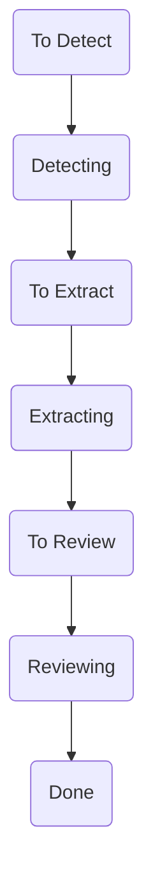

# Tocky

A tool to extract table of contents data from Internet Archive books.

## Phases

- **Detector**: Responsible for finding the pages that contain the table of contents in the book.
- **Extractor**: Given the pages containing the table of contents, this phase is responsible for converting those pages to a structured format.

## Pipeline

A task moves through the pipeline in the following order:



## Development

Activate the virtual environment:

```bash
source .venv/Scripts/activate
```

Useful snippet for doing DB operations:

```py
import app
from contextlib import closing

with closing(app.get_conn()) as conn:
    with closing(conn.cursor()) as cur:
        cur.execute("""
            SELECT * FROM toc_queue
            WHERE state = 'Reviewing'
        """)
        conn.commit()
```
