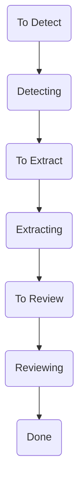

# Tocky

A tool to extract table of contents data from Internet Archive books.

## Phases

- **Detector**: Responsible for finding the pages that contain the table of
  contents in the book.
- **Extractor**: Given the pages containing the table of contents, this phase is
  responsible for converting those pages to a structured format.

## Installation

```sh
pip install tocky
```

Optional extras:

- `pip install tocky[easyocr]` to also install EasyOCR dependencies
- `pip install tocky[tesseract]` to also install Tesseract dependencies
- `pip install tocky[app]` to also install the web app dependencies

## Pipeline

A task moves through the pipeline in the following order:


```mermaid
flowchart TD
    A(To Detect)
    --> B(Detecting)
    --> C(To Extract)
    --> D(Extracting)
    --> E(To Review)
    --> F(Reviewing)
    --> G(Done)
```

## Development

Activate the virtual environment:

```bash
source .venv/Scripts/activate
```

Running tests:

```bash
pytest tests
```

Useful snippet for doing DB operations:

```py
import app
from contextlib import closing

with closing(app.get_conn()) as conn:
    with closing(conn.cursor()) as cur:
        cur.execute("""
            SELECT * FROM toc_queue
            WHERE state = 'Reviewing'
        """)
        conn.commit()
```

Removing a book from the queue:

```py
import app
from contextlib import closing

with closing(app.get_conn()) as conn:
    with closing(conn.cursor()) as cur:
        cur.execute("""
            DELETE FROM toc_queue
            WHERE id = '847'
        """)
        conn.commit()
```

### Releases

To create a new release, update the version in `pyproject.toml` and run:

```sh
poetry version patch
poetry build
poetry publish
git add pyproject.toml
git commit -m "vX.Y.Z"
git tag vX.Y.Z
git push origin master --tags
```

## Options

### OCR Engine

Tocky supports books with existing OCR data, with the option to redo the OCR
using a custom engine. Each engine has its own pros and cons:

| Engine    | CPU? | Self-hosted? | Lines? | Paragraphs? | Columns? | Handles leader dots? | Handles single pagenums? | Confidence scores? |
| --------- | ---- | ------------ | ------ | ----------- | -------- | -------------------- | ------------------------ | ------------------ |
| Tesseract | ✅   | ✅           | ✅     | ✅          | ✅       | ❌                   | Rarely                   | ✅                 |
| EasyOCR   | ❌   | ✅           | ❌     | ❌          | ❌       | ✅                   | Sometimes                | ❔                 |
| Azure     | ✅   | ❌           | ✅     | ❌          | ❔       | ✅                   | ✅                       | ✅                 |
